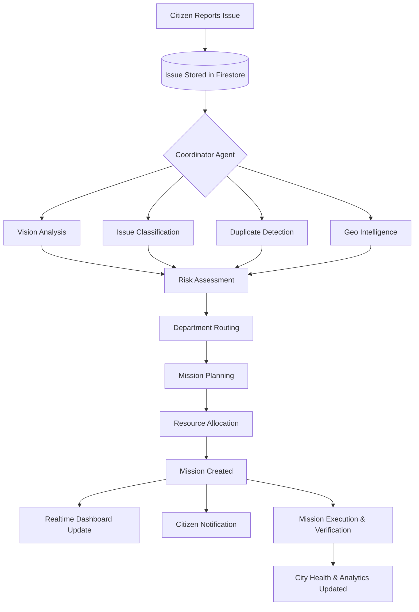

<div align="center">
  <h1>🏙️ CityOS AI</h1>
  <p><strong>AI-Powered Autonomous Civic Operations Platform</strong></p>

  <p>
    <a href="#problem-statement">Problem</a> •
    <a href="#solution-overview">Solution</a> •
    <a href="#key-features">Features</a> •
    <a href="#system-workflow">Workflow</a> •
    <a href="#technologies">Tech Stack</a> •
    <a href="#getting-started">Getting Started</a>
  </p>
</div>

---

## 🚨 Problem Statement

**Community Hero – Hyperlocal Problem Solver**

Communities frequently encounter civic issues such as potholes, water leakages, damaged streetlights, waste accumulation, drainage problems, and other public infrastructure challenges. Existing reporting systems are fragmented, lack transparency, provide limited visibility into issue resolution, and often require significant manual coordination across departments.

The objective is to develop an intelligent platform that enables citizens to report issues while leveraging AI to automate classification, prioritization, planning, tracking, and resolution through an autonomous operational workflow.

---

## 💡 Solution Overview

**CityOS AI** is an AI-powered Civic Operating System that transforms traditional complaint management into an intelligent, autonomous city operations platform.

Instead of simply collecting complaints, CityOS AI orchestrates a collaborative AI workforce that analyzes reported issues, evaluates risks, assigns responsible departments, generates missions, tracks execution, updates a live Digital Twin of the city, and continuously keeps citizens informed.

The platform combines artificial intelligence, cloud infrastructure, geospatial visualization, realtime synchronization, and autonomous decision-making to create a modern digital governance solution.

---

## ✨ Key Features

### 1. AI-Powered Smart Issue Reporting
Citizens can report civic issues using images, videos, voice recordings, text descriptions, and interactive map locations. The platform automatically extracts contextual information and minimizes manual input.

### 2. Autonomous Multi-Agent AI Workforce
Instead of relying on a single AI model, CityOS AI uses a collaborative AI workforce powered by **LangGraph**. Each agent performs a dedicated responsibility and contributes to a shared workflow:
- 🕵️ **Coordinator Agent**
- 🏷️ **Issue Classification Agent**
- 👁️ **Vision Analysis Agent**
- 👯 **Duplicate Detection Agent**
- 🌍 **Geo Intelligence Agent**
- ⚠️ **Risk Assessment Agent**
- 🏗️ **Infrastructure Intelligence Agent**
- 🏢 **Department Routing Agent**
- 📋 **Mission Planning Agent**
- 🛠️ **Resource Allocation Agent**
- 📢 **Citizen Communication Agent**
- 📝 **Audit Agent & Memory Agent**

### 3. Intelligent Issue Analysis
After submission, AI automatically performs infrastructure damage detection, categorization, severity estimation, duplicate detection, risk analysis, and department identification. Every recommendation includes confidence scores and reasoning.

### 4. Digital Twin of the City
A live digital representation of the city through an interactive map displaying active issues, mission routes, repair crew locations, prediction zones, heatmaps, and infrastructure layers.

### 5. Autonomous Mission Management
AI automatically transforms reported issues into operational missions with priority levels, assigned departments, resource requirements, estimated durations, and verification workflows.

### 6. AI Explainability & Workforce Monitoring
Every AI decision remains transparent. The system displays the responsible agent, reasoning summary, supporting evidence, and confidence scores. Users can observe the complete AI execution process in realtime.

### 7. City Health & Analytics Dashboard
Continuously evaluates the overall operational condition of the city (Roads, Water, Traffic, Electricity, etc.) and provides AI-assisted operational analytics for proactive decision-making.

---

## 🔄 System Workflow



---

## 🛠️ Technologies Used

### Frontend
- **Framework:** Next.js, React, TypeScript
- **Styling:** Tailwind CSS, Framer Motion
- **Maps:** MapLibre GL JS, OpenStreetMap, Turf.js

### Backend & AI
- **Framework:** FastAPI, Python, Pydantic
- **AI Agent Orchestration:** LangGraph Multi-Agent Architecture
- **LLM:** Google Gemini API 

### Cloud & Infrastructure (Google Ecosystem)
- **Database:** Google Firestore (Realtime synchronization)
- **Hosting:** Google Cloud Run
- **CI/CD:** Google Cloud Build
- **Security:** Google Secret Manager
- **Observability:** Google Cloud Logging

---

## 🚀 Getting Started

### Prerequisites
- Node.js 20+
- Python 3.11+
- Google Cloud / Firebase Account
- Gemini API Key

### Backend Setup
```bash
cd backend
python -m venv venv
source venv/bin/activate
pip install -r requirements.txt

# Configure your environment variables
cp .env.example .env

# Start the FastAPI server
uvicorn app.main:app --reload --port 8000
```

### Frontend Setup
```bash
cd frontend
npm install

# Configure your environment variables
cp .env.local.example .env.local

# Start the Next.js development server
npm run dev
```

The application will be available at `http://localhost:3000`.

---

## 🔮 Innovation Highlights & Future Scope

CityOS AI introduces autonomous multi-agent AI collaboration, explainable AI with transparent reasoning, a live Digital Twin, and realtime mission lifecycle management.

**Future Enhancements:**
- IoT sensor integration and Drone-assisted infrastructure inspection.
- Predictive maintenance and traffic optimization.
- Integration with municipal ERP and GIS platforms.
