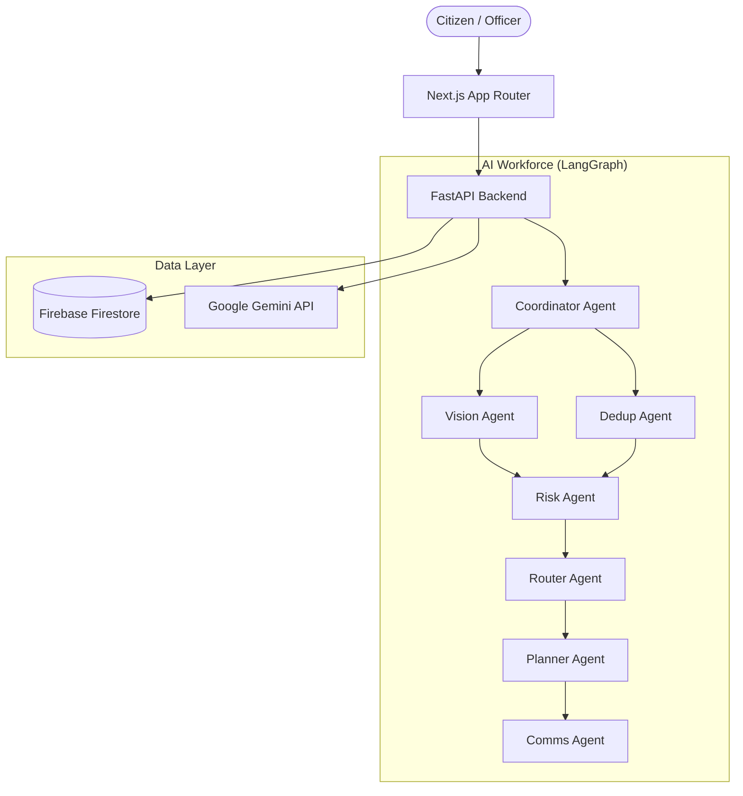

<div align="center">
  
  
  # CityOS AI — Urban Intelligence OS
  
  **The AI operating system for modern smart cities.** <br/>
  CityOS AI transforms civic management from reactive complaint tracking into a proactive, autonomous, and intelligent ecosystem powered by Google Gemini and LangGraph.

  [](https://nextjs.org/)
  [](https://fastapi.tiangolo.com/)
  [](https://ai.google.dev/)
  [](https://python.langchain.com/docs/langgraph)
</div>

---

## 🌆 What is CityOS AI?

Traditional municipal software is a static list of complaints. CityOS AI is a **living, breathing AI workforce**. 

When a citizen reports an issue (e.g., a pothole), CityOS AI doesn't just log it. A swarm of specialized AI agents immediately springs into action to:
1. **Understand** the severity through computer vision.
2. **Deduplicate** against thousands of existing reports.
3. **Assess risk** by cross-referencing weather forecasts and critical infrastructure proximity.
4. **Plan** the repair and automatically route the work order to the right department.
5. **Predict** downstream failures before they happen.

It feels less like a dashboard, and more like Mission Control for your city.

---

## ✨ Key Features

- **🧠 Multi-Agent Autonomous Workforce**: Powered by LangGraph, a team of 7 specialized AI agents (Coordinator, Vision, Router, Risk, etc.) collaborate to process civic issues autonomously.
- **👁️ Urban Intelligence UI**: A completely reimagined interface that ditches traditional dashboards. The city map *is* the application. Built with Next.js, Framer Motion, and a custom Apple-inspired design system.
- **🔮 Predictive Digital Twin**: A time-scrubbing simulator that predicts future infrastructure failures based on current data and environmental forecasts.
- **🤝 Community Trust Engine**: Citizens don't just report; they verify. An AI-moderated trust system gamifies civic participation.
- **🕵️ Transparent AI Audit**: Every decision made by the AI workforce is logged, explained, and auditable by city executives.

---

## 🏗️ Architecture

CityOS AI is a modern monorepo divided into a high-performance Python backend and a cinematic React frontend.



### Tech Stack
* **Frontend:** Next.js 14 (App Router), React, Tailwind CSS, Framer Motion, Zustand, Lucide Icons.
* **Backend:** Python 3.11, FastAPI, Uvicorn, Pydantic.
* **AI & Orchestration:** Google Gemini Pro, LangChain, LangGraph.
* **Database & Auth:** Firebase Firestore, Firebase Authentication.

---

## 🚀 Getting Started

### Prerequisites
- Node.js (v18+)
- Python (v3.11+)
- Google Gemini API Key ([Get one here](https://aistudio.google.com/))
- Firebase Project with Firestore enabled

### 1. Clone the Repository
```bash
git clone https://github.com/yourusername/cityos-ai.git
cd cityos-ai
```

### 2. Setup the Backend (FastAPI + LangGraph)
```bash
cd backend

# Create and activate virtual environment
python -m venv venv
source venv/bin/activate  # On Windows: venv\Scripts\activate

# Install dependencies
pip install -r requirements.txt

# Environment variables
cp .env.example .env
```
*Edit `backend/.env` and add your `GEMINI_API_KEY`.*

*For Firebase, either place your service account JSON file at `backend/firebase-adminsdk.json` or configure the environment variables in `.env`.*

```bash
# Run the backend server
uvicorn app.main:app --reload
# Server runs on http://localhost:8000
```

### 3. Setup the Frontend (Next.js)
Open a new terminal window:
```bash
cd frontend

# Install dependencies
npm install

# Environment variables
cp .env.local.example .env.local
```
*Edit `frontend/.env.local` and add your Firebase Web App configuration.*

```bash
# Run the frontend development server
npm run dev
# App runs on http://localhost:3000
```

---

## 🎮 The Experience

Navigate to `http://localhost:3000` to experience the Urban Intelligence OS.

### Recommended Tour:
1. **`/report`**: Try the AI-guided issue reporting wizard.
2. **`/control-room`**: Watch the LangGraph multi-agent neural network execute in real-time.
3. **`/simulator`**: Use the Digital Twin slider to predict future infrastructure failures.
4. **`/executive`**: Review the transparent AI audit logs.

---

## 📂 Project Structure

```text
cityos-ai/
├── backend/                  # Python FastAPI application
│   ├── app/
│   │   ├── agents/           # LangGraph multi-agent system
│   │   ├── api/              # REST API endpoints
│   │   ├── core/             # Configuration and security
│   │   ├── models/           # Domain models
│   │   └── services/         # Business logic
│   └── requirements.txt      
│
├── frontend/                 # Next.js React application
│   ├── src/
│   │   ├── app/              # Next.js App Router pages
│   │   ├── components/       # UI components (Map, Drawer, Shell)
│   │   ├── config/           # Firebase & API config
│   │   ├── hooks/            # React hooks (Zustand state)
│   │   └── services/         # API integration layer
│   └── globals.css           # Urban Intelligence OS design system
```

---

## 🛡️ License

This project is licensed under the MIT License. See the [LICENSE](LICENSE) file for details.

---
<div align="center">
  Built with ❤️ for the future of our cities.
</div>
