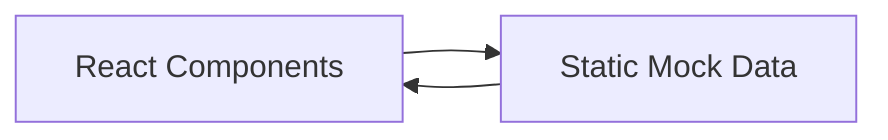
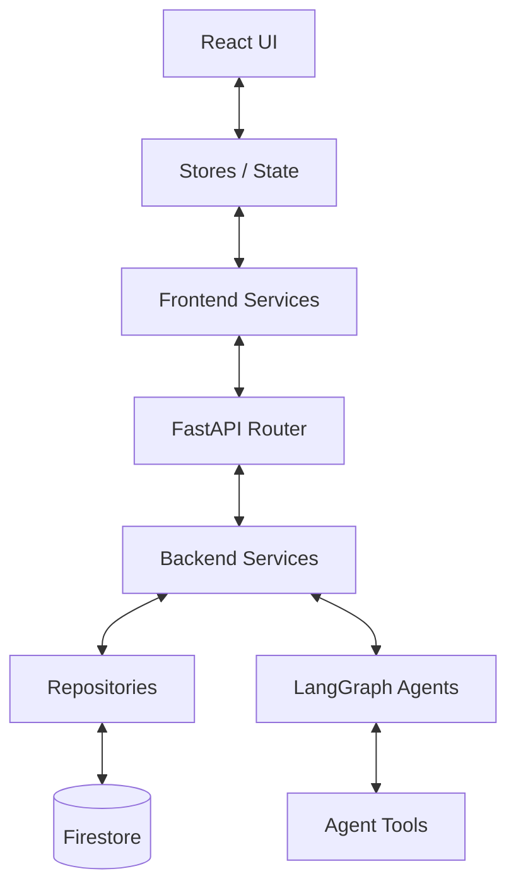

# CityOS AI — Architecture Overview (Phase A)

## Introduction
This document serves as the architectural foundation of the CityOS AI platform, finalized during Phase A. The goal of this phase was to stabilize the codebase, properly isolate concerns, establish strict directory structures, and identify integration points for Phase B (Firestore & LangGraph).

---

## 1. Directory Structure

### Frontend (`frontend/src/`)
*   **`app/`**: Next.js 14 App Router. Contains all page routes, layouts, and error boundaries.
*   **`components/`**: Reusable React components.
    *   `shell/`: App shell components (NavRail, TopBar, ThemeProvider).
    *   `ui/`: Generic, stateless design system components (Button, Card, Badge).
    *   `workspace/`: Complex, stateful domain components (MissionQueue, ContextPanel).
*   **`config/`**: Centralized configuration (`index.ts`) for environments and API limits.
*   **`features/`**: Domain-driven feature modules (e.g., `map/`). Contains local components, hooks, and types specific to the feature.
*   **`hooks/`**: Global custom React hooks.
*   **`integrations/`**: (Phase B) Third-party SDK wrappers (Firebase, MapLibre configurations).
*   **`lib/`**: Global utilities and static mock data (annotated for Phase B replacement).
*   **`providers/`**: Global React Context providers (Auth, RealtimeSync).
*   **`services/`**: (Phase B) API service clients to interface with the FastAPI backend.
*   **`stores/`**: (Phase B) Global state management (Zustand/Redux).
*   **`styles/`**: Global CSS and design tokens.
*   **`types/`**: Global TypeScript interfaces (`index.ts`).
*   **`utils/`**: Helper functions (e.g., `logger.ts`, formatters).

### Backend (`backend/app/`)
*   **`api/`**: FastAPI routers grouped by version (`v1/`).
*   **`agents/`**: LangGraph AI agent nodes (`coordinator`, `vision`, `routing`). Currently scaffolded.
*   **`core/`**: Core application config, security, and global Firebase instances.
*   **`db/`**: (Phase B) Firestore connection handlers.
*   **`models/`**: Pydantic response/request models.
*   **`repositories/`**: (Phase B) Data access layer abstracting Firestore logic.
*   **`services/`**: Business logic that coordinates between API routes, repositories, and AI tools.
*   **`tools/`**: (Phase B) Tools that LangGraph agents can invoke (e.g., query database, send email).
*   **`utils/`**: General backend helpers.

---

## 2. Data Flow (Current vs. Target)

### Current Flow (Phase A)

*Status*: Currently, all data originates from `frontend/src/lib/mock.ts` and `frontend/src/features/map/data/city.ts`.

### Target Flow (Phase B)

---

## 3. Mock Data Inventory
All mock data has been clearly annotated with JSDoc `@warning` tags and `@todo` markers pointing to Phase B.
*   `frontend/src/lib/mock.ts`: Contains `ISSUES`, `MISSIONS`, `AGENTS`, `PREDICTIONS`, `DEPARTMENTS`.
*   `frontend/src/features/map/data/city.ts`: Contains map-specific geometries (`GEO_ISSUES`, `GEO_PREDICTIONS`, `COMMUNITY_REPORTS`).

---

## 4. Phase B Readiness Checklist
*   [ ] Connect Frontend `services` to Backend `api` routes using `fetch`/`axios`.
*   [ ] Implement `backend/app/db/` Firebase Admin initialization.
*   [ ] Build `backend/app/repositories/` to read/write from Firestore collections.
*   [ ] Migrate `mock.ts` data into Firestore collections as seed data.
*   [ ] Implement the `coordinator` LangGraph logic in `backend/app/agents/coordinator/graph.py`.
*   [ ] Connect the `AgentNetwork.tsx` UI to a real WebSocket or Server-Sent Events stream from FastAPI.
